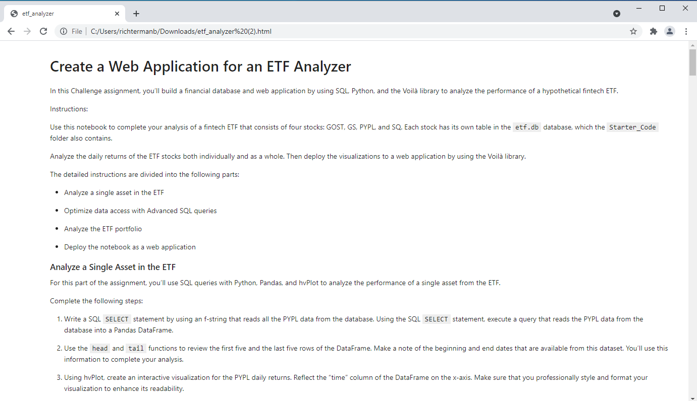
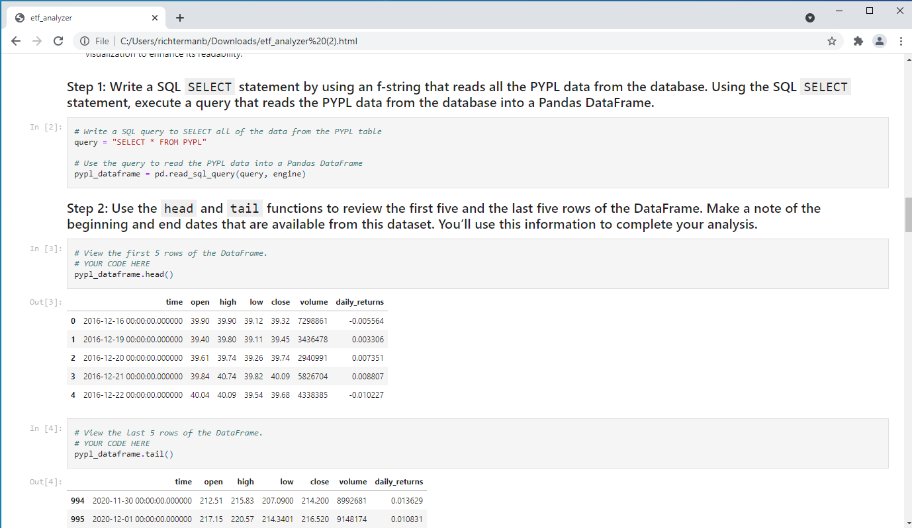
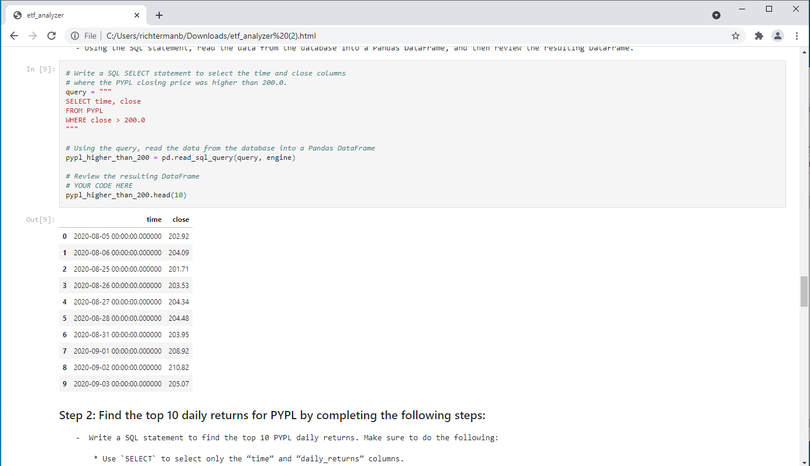
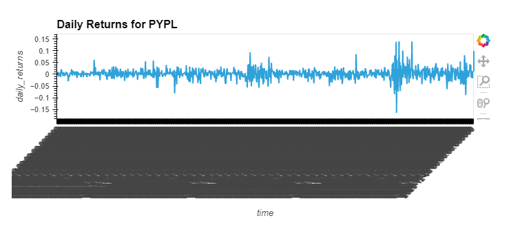
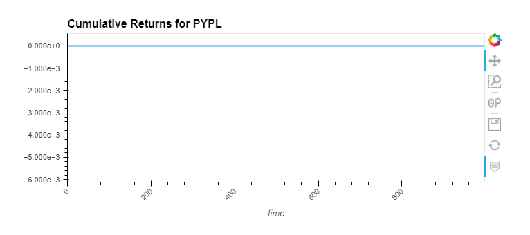
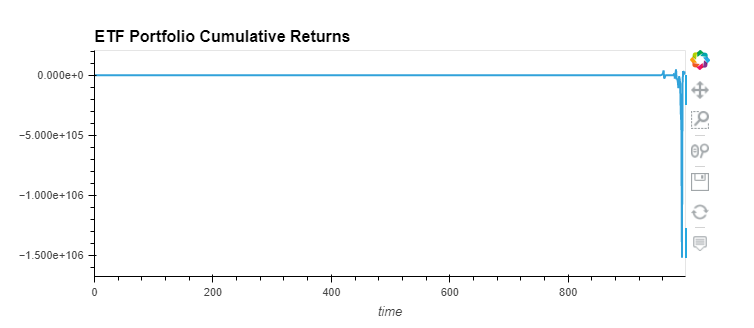

# Challenge-07: SQL
## Financial Databases
*In this challenge I built a financial database and web application by using SQL, Python, and the Voila library to analyze the performance of a hypothetical fintech ETF.*

## Libraries to Import

import numpy as np  
import pandas as pd  
import hvplot.pandas  
import sqlalchemy  

## Voila, Code, and Visualizations

**Voila** 

---

**Daily Returns for PYPL**

---

**Cumulative Returns for PYPL**

---

**ETF Portfolio Cumulative Returns**

